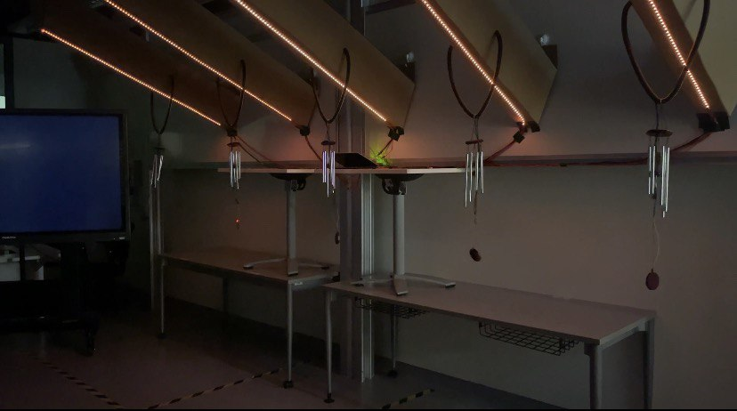

<!DOCTYPE html>
<html>
  
<body>
  <h1>Hi there! I'm Muthu!&#128513;</h1>
  <h3>I'm a CSD student from SUTD who likes to code!!&#128187;</h3>
  <h2>I have facilitated the following workshops:</h2>

  <ul>
    <li>
      <h4><a href="https://gdsc.community.dev/events/details/developer-student-clubs-singapore-university-of-technology-and-design-presents-intro-to-javascript/">3DC Intro to JavaScript Workshop</a></h4>
       
      <a href="https://github.com/r-muthu/Intro-to-JS-workshop/tree/main">To access the resources used for the workshop, click here.</a>
      
This is a workshop that I prepared and facilitated on my own. I hope you will find these resources useful!!!

    </li>
     
    <li>
      <h4>3DC goes to Hwachong!!! &#40;Robot Mechanisms&#41;</h4>
       
      <a href="docs/assets/videos/hcrobot.mp4">To see the video of a Stick' Em Robot built by Hwachong students, click here.</a>
    </li>
  </ul>

  <h2>I have participated in the following projects:</h2>
  <ul>
    <li>
      <h4>Design Thinking and Innovation Project 2023: 50ARCHES</h4>
       
      <a href="docs/assets/videos/ripple_effect.mp4">To see the demonstration of the colour-changing ripple-effect of the light installations, click here.</a>
    </li>
    <li><h4>SUTD Electric Vehicle Club J23 Go Kart Project</h4></li>
  </ul>

  
</body>
